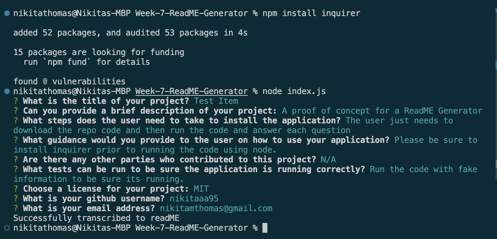

# ReadME Generator
Github Repo - https://github.com/Nikitaaa95/ReadME-Generator
Screenrecording Video - https://drive.google.com/file/d/1bi-Mm37uVPt36jdT6jMMKq5mfwHw4yco/view

## Description

This is a tool to help other software engineers to create a ReadME with information relevant to whatever project they're currently working on.

## Usage

User should pull the code from from the github repo provided and run "npm install inquirer" and then run the index.js and answer the prompts as they appear. Once all the questions have been addressed, a new ReadMe file will be generated.

View the readme and edit it as you like if you want to change formatting or add more details.

### 

## Credits

Please see the following sites/resources that were used in my research for this project:

### Developer Code provided directly from bootcamp

### AskBCS Learning Assistant
-Helped me with debugging the issues I was facing when importing the markdown module

### Guidance on License Badges
https://gist.github.com/lukas-h/2a5d00690736b4c3a7ba